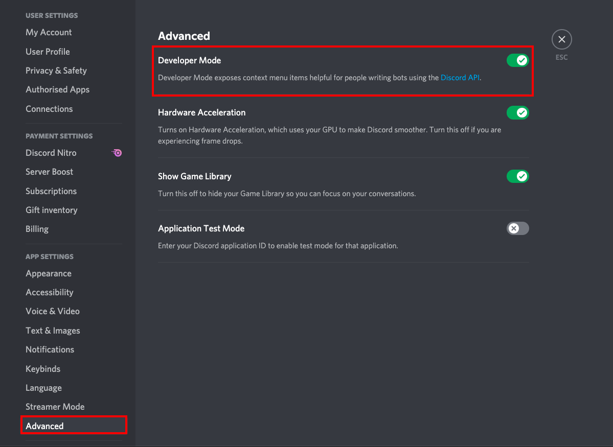
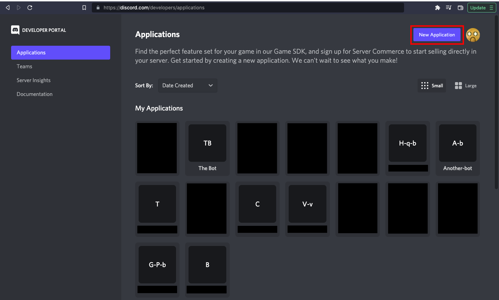

# Create the Praise Discord bot

### 1. Enable Developer Mode

Discord Developer Mode needs to be enabled so that you can copy object IDs from discord's UI. You can toggle this setting in the `Advanced` section of your Discord User Settings.



### 2. Discord Guild ID

Right click on your Discord server icon and select `Copy ID`. Take note of this value, in the Praise ENV settings it is called `Discord Guild ID`.

### 3. Create Praise giver role

Only Discord users that are assigned the Praise Giver role are allowed to praise. To create this role on your server:

- Select `Server Settings` from the dropdown menu next to the server name
- Open the `Roles` tab
- Click the `Create Role` button
- Give the role a suitable name (Praise giver?).
- Right click on the role name in the role menu and click on `Copy ID`.

Add the role in the Praise system settings.

### 4. Create Discord application

- Log into the [Discord Developer Portal](https://discord.com/login?redirect_to=%2Fdevelopers%2Fapplications) using your discord credentials.
- Under `Applications` click on `New Application` on the top right.
  
- Choose a suitable name for your application.

### 5. Add bot to application

- Open the `Bot` tab in the info page of the application you just created
- Create a bot using the `Add Bot` button.
- In the `Bot` tab, find the `Privileged Gateway Intents` section and enable `SERVER MEMBERS INTENT` and `MESSAGE CONTENT INTENT`.

### 6. Reset and copy bot token

- Press the `Reset Token` button to reset and generate a bot token.
- Copy and note the generated bot token. This is the Praise ENV settings `Discord Token`.
  > NOTE - Do not share this token publically and ensure that it isn't posted anywhere.

### 7. Discord Client ID

- Go to the `General Information` tab of your application.
- Copy and note `APPLICATION ID`. This is the Praise ENV settings `Discord Client ID`.

### 8. Invite bot to Discord server

Invite the bot to your server using this link:

```
https://discord.com/api/oauth2/authorize?client_id=<APPLICATION ID>&permissions=378561611840&scope=bot%20applications.commands/
```

Replace `<APPLICATION ID>` with the numeric APPLICATION ID you just copied.
